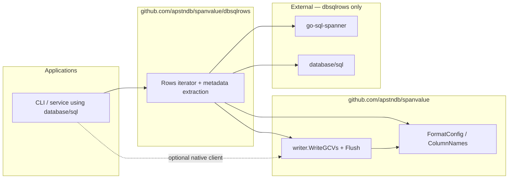

# dbsqlrows

Optional Go module for exporting [go-sql-spanner](https://github.com/googleapis/go-sql-spanner)
`database/sql` query results through existing
[`spanvalue/writer`](https://pkg.go.dev/github.com/apstndb/spanvalue/writer)
GenericColumnValue streaming APIs.

```text
module github.com/apstndb/spanvalue/dbsqlrows
```

## Goals

- Own the `*sql.Rows` loop: metadata pseudo-row → data rows → optional stats pseudo-row.
- Default to `DecodeOptionProto` and `ReturnResultSetMetadata` (go-sql-spanner v1.15.0+).
- Delegate formatting to `writer.WriteGCVs` / `Flush` (same path as the root README manual loop).
- Keep `github.com/googleapis/go-sql-spanner` **out of** the root `github.com/apstndb/spanvalue` module.
- Expose **minimal primitives** for apps that split metadata, rendering, and stats (spannersh).

## Non-goals

- Native `*spanner.RowIterator` export ([`writer.WriteRowIterator`](../writer/README.md)).
- String → GCV parsing, PostgreSQL table cells ([spanpg](https://github.com/apstndb/spanpg)), or `gcvctor` changes.
- Table rendering, batch orchestration, drain-only modes, or statement hooks — callers (e.g. [spannersh](https://github.com/apstndb/spannersh)) keep app-specific logic.
- SQL INSERT export in v1 unless trivial.

## Dependency diagram



## API overview

| Entry point | When to use |
|-------------|-------------|
| [`QueryExport`](export.go) | One-shot `db.QueryContext` + export |
| [`ExportRows`](export.go) | Open `*sql.Rows`; reads metadata pseudo-row when `ReturnResultSetMetadata` |
| [`ReadMetadataAndAdvanceToData`](metadata.go) | Metadata-first apps; advances cursor to data rows |
| [`ExportRowsAtData`](export.go) | Rows already at data + metadata known (after table render or batch step) |

[`ExportResult`](export.go) always carries `Metadata` when known (including error paths after prepare/write, matching [`writer.RowIteratorResult`](../writer/row_iterator.go) partial-result semantics).

### Stats after export

`DefaultExecOptions` sets `ReturnResultSetStats: false`. [`ExportRows`](export.go) does not consume the trailing stats pseudo-row unless `ExecOptions.ReturnResultSetStats` or [`ExportConfig.ReadResultSetStats`](export.go) is true.

[`ExportRowsAtData`](export.go) never reads stats unless `ExportConfig.ReadResultSetStats` is true, so callers can render data rows first and then advance `rows` to stats themselves (spannersh execution summary).

## spannersh integration sketch

spannersh keeps table render, batch loops, EXPLAIN drain, and hooks in-repo. dbsqlrows supplies the shared GCV export loop:

```go
// Multi-statement batch: read metadata, render, read stats outside dbsqlrows.
md, ok, err := dbsqlrows.ReadMetadataAndAdvanceToData(rows)
if err != nil || !ok {
    return err
}
n, err := renderTable(out, md, rows) // spannersh-owned
if err != nil {
    return err
}
rss, err := fetchResultSetStatsAfterDataRows(rows) // spannersh-owned
// ...

// CSV/JSONL at data rows (writer built with metadata via DelimitedGCVExportOptions):
w, err := writer.NewCSVWriter(out, writer.DelimitedGCVExportOptions(md, fc, namer)...)
result, err := dbsqlrows.ExportRowsAtData(rows, md, w, dbsqlrows.ExportConfig{})
_ = result.Metadata // same md
_ = result.RowsRead

// One-shot export (metadata + data; stats left on rows):
result, err := dbsqlrows.QueryExport(ctx, db, q, nil, w, dbsqlrows.ExportConfig{})
```

## Usage sketch

```go
w, err := writer.NewCSVWriter(out, writer.WithHeader(true))
if err != nil {
    return err
}
result, err := dbsqlrows.QueryExport(ctx, db, "SELECT id, name FROM Singers", nil, w, dbsqlrows.ExportConfig{})
if err != nil {
    return err
}
_ = result.Metadata
```

When metadata is already registered on the writer (`DelimitedGCVExportOptions`), call [`ExportRowsAtData`](export.go) on rows positioned at the data result set.

## Related

- [#178](https://github.com/apstndb/spanvalue/issues/178) — module design
- [#109](https://github.com/apstndb/spanvalue/issues/109) — adoption docs
- [#110](https://github.com/apstndb/spanvalue/issues/110) — `ColumnNames` / namer consistency
- [Root README — go-sql-spanner export](../README.md#go-sql-spanner-and-genericcolumnvalue-export)

## Development

```bash
cd dbsqlrows
go test ./...
```

Root `make check` does not build this module; CI for dbsqlrows is added separately.
