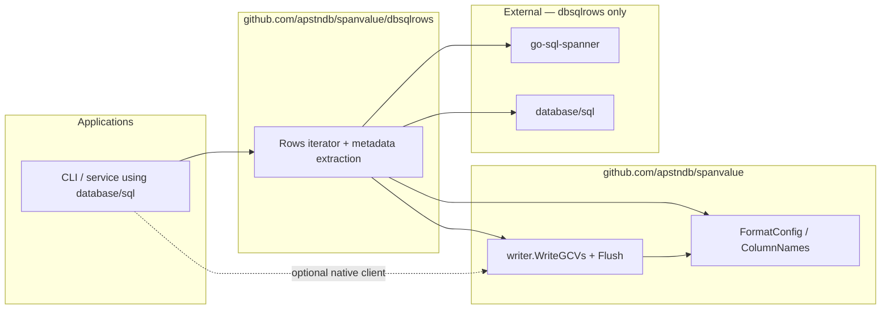

# dbsqlrows

Optional Go module for exporting [go-sql-spanner](https://github.com/googleapis/go-sql-spanner)
`database/sql` query results through existing
[`spanvalue/writer`](https://pkg.go.dev/github.com/apstndb/spanvalue/writer)
GenericColumnValue streaming APIs.

```text
module github.com/apstndb/spanvalue/dbsqlrows
```

## Goals

- Own the `*sql.Rows` loop: metadata pseudo-row → data rows → optional stats pseudo-row.
- Default to `DecodeOptionProto` and `ReturnResultSetMetadata` (go-sql-spanner v1.15.0+).
- Delegate formatting to `writer.WriteGCVs` / `Flush` (same path as the root README manual loop).
- Keep `github.com/googleapis/go-sql-spanner` **out of** the root `github.com/apstndb/spanvalue` module.

## Non-goals

- Native `*spanner.RowIterator` export ([`writer.WriteRowIterator`](../writer/README.md)).
- String → GCV parsing, PostgreSQL table cells ([spanpg](https://github.com/apstndb/spanpg)), or `gcvctor` changes.
- Full spannersh script semantics (custom pseudo-rows, multi-statement scripts).
- SQL INSERT export in v1 unless trivial.

## Dependency diagram



## Usage sketch (WIP)

```go
w, err := writer.NewCSVWriter(out, writer.WithHeader(true))
if err != nil {
    return err
}
result, err := dbsqlrows.QueryExport(ctx, db, "SELECT id, name FROM Singers", nil, w, dbsqlrows.ExportConfig{})
if err != nil {
    return err
}
_ = result.Metadata
```

When metadata is already registered on the writer, call [`ExportRows`](export.go) on an open
`*sql.Rows` and pass `ExecOptions` without `ReturnResultSetMetadata`.

## Related

- [#178](https://github.com/apstndb/spanvalue/issues/178) — module design
- [#109](https://github.com/apstndb/spanvalue/issues/109) — adoption docs
- [#110](https://github.com/apstndb/spanvalue/issues/110) — `ColumnNames` / namer consistency
- [Root README — go-sql-spanner export](../README.md#go-sql-spanner-and-genericcolumnvalue-export)

## Development

```bash
cd dbsqlrows
go test ./...
```

Root `make check` does not build this module; CI for dbsqlrows is added separately.
