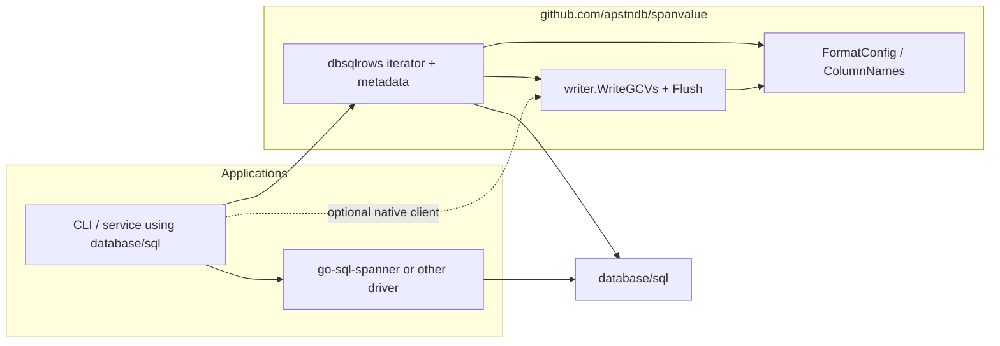

# dbsqlrows

Package under [`github.com/apstndb/spanvalue`](https://pkg.go.dev/github.com/apstndb/spanvalue)
for exporting `database/sql` query results through existing
[`spanvalue/writer`](https://pkg.go.dev/github.com/apstndb/spanvalue/writer)
GenericColumnValue streaming APIs.

The package is **driver-agnostic**: it assumes a convention (metadata pseudo-row →
data rows → optional stats pseudo-row with proto-decoded GCV columns) that
[go-sql-spanner](https://github.com/googleapis/go-sql-spanner) implements, but does
not import that driver. Callers configure the driver themselves.

```text
import "github.com/apstndb/spanvalue/dbsqlrows"
```

## Goals

- Own the `*sql.Rows` loop: metadata pseudo-row → data rows → optional stats pseudo-row.
- Delegate formatting to `writer.WriteGCVs` / `Flush` (same path as the root README manual loop).
- Keep database/sql drivers **out of** spanvalue `go.mod` (no go-sql-spanner dependency).
- Expose **minimal primitives** for apps that split metadata, rendering, and stats (spannersh).

## Non-goals

- Native `*spanner.RowIterator` export ([`writer.WriteRowIterator`](../writer/README.md)).
- String → GCV parsing, PostgreSQL table cells ([spanpg](https://github.com/apstndb/spanpg)), or `gcvctor` changes.
- Built-in ASCII table layout (`tablewriter` or similar) — apps supply [`SQLRowsHooks`](hooks.go).
- Batch orchestration or statement hooks — callers (e.g. [spannersh](https://github.com/apstndb/spannersh)) keep app loops.
- SQL INSERT export in v1 unless trivial.
- Owning `db.QueryContext` or driver `ExecOptions` — callers open `*sql.Rows`.

## Dependency diagram



## API overview

| Entry point | When to use |
|-------------|-------------|
| [`ExportRows`](export.go) | Open `*sql.Rows` at metadata pseudo-row; csv/jsonl via [`GCVStreamWriter`](export.go) |
| [`RunRows`](hooks.go) / [`RunRowsAtData`](hooks.go) | Custom sinks via [`SQLRowsHooks`](hooks.go) (table, observe-only) |
| [`ReadMetadataAndAdvanceToData`](metadata.go) | Metadata-first apps; advances cursor to data rows |
| [`ExportRowsAtData`](export.go) | Thin wrapper: `RunRowsAtData` + [`SQLRowsHooksFromGCVWriter`](hooks.go) |

### writer ↔ dbsqlrows symmetry

| writer (native client) | dbsqlrows (database/sql) |
|------------------------|--------------------------|
| [`RunRowIterator`](../writer/row_iterator.go) | [`RunRows`](hooks.go) / [`RunRowsAtData`](hooks.go) |
| [`RowIteratorHooks`](../writer/row_iterator.go) | [`SQLRowsHooks`](hooks.go) |
| [`RowIteratorHooksFromWriter`](../writer/row_iterator.go) | [`SQLRowsHooksFromGCVWriter`](hooks.go) |
| [`RowIteratorResult`](../writer/row_iterator.go) | [`ExportResult`](export.go) |
| `*spanner.Row` | `[]spanner.GenericColumnValue` |

[`ExportResult`](export.go) always carries `Metadata` when known (including error paths after prepare/write, matching [`writer.RowIteratorResult`](../writer/row_iterator.go) partial-result semantics).

### Stats after export

[`ExportRows`](export.go) and [`ExportRowsAtData`](export.go) do not consume the trailing stats pseudo-row unless [`ExportConfig.ReadResultSetStats`](export.go) is true. When stats are read, the iterator advances with `NextResultSet()` so multi-statement batches can read the next metadata row.

## go-sql-spanner integration

### Option A: core cookbook (driver-agnostic)

Apps using [go-sql-spanner](https://github.com/googleapis/go-sql-spanner) configure
`ExecOptions` at query time, then pass the open `*sql.Rows` to dbsqlrows:

```go
import (
    "context"
    "database/sql"

    spannerdriver "github.com/googleapis/go-sql-spanner"
    "github.com/apstndb/spanvalue/dbsqlrows"
    "github.com/apstndb/spanvalue/writer"
)

opts := spannerdriver.ExecOptions{
    DecodeOption:            spannerdriver.DecodeOptionProto,
    ReturnResultSetMetadata: true,
    ReturnResultSetStats:    false, // read stats after export if needed
}
rows, err := db.QueryContext(ctx, q, opts)
if err != nil {
    return err
}
defer rows.Close()

w, err := writer.NewCSVWriter(out, writer.WithHeader(true))
if err != nil {
    return err
}
result, err := dbsqlrows.ExportRows(rows, w, dbsqlrows.ExportConfig{})
if err != nil {
    return err
}
_ = result.Metadata
// rows remain on data result set; advance to stats pseudo-row in app code if needed
```

Set `ReturnResultSetStats: true` on the driver only when the app does not need to
render data before reading stats. Otherwise leave it false and use
`ExportConfig.ReadResultSetStats` or app-owned stats draining.

### Option B: optional `gospanner` nested module

When the app already depends on go-sql-spanner and wants a one-shot query +
export helper, use the separate module
[`github.com/apstndb/spanvalue/dbsqlrows/gospanner`](gospanner/README.md):

- [`DefaultExecOptions`](gospanner/export.go) — recommended `ExecOptions`
- [`QueryExport`](gospanner/export.go) — `QueryContext` + `ExportRows`

Root `go.mod` still has no go-sql-spanner; only importers of `gospanner` pull
the driver in.

## spannersh integration sketch

spannersh keeps batch loops, EXPLAIN drain, and layout libraries in-repo. dbsqlrows owns the shared `*sql.Rows` loop; apps own formatting.

```go
// Multi-statement batch: read metadata, render, read stats outside dbsqlrows.
md, ok, err := dbsqlrows.ReadMetadataAndAdvanceToData(rows)
if err != nil || !ok {
    return err
}

// Table (spannersh-owned tablewriter + cell formatting):
result, err := dbsqlrows.RunRowsAtData(rows, md, dbsqlrows.NewSQLRowsHooks().
    WithPrepareMetadata(func(md *sppb.ResultSetMetadata) error {
        return table.PrepareHeader(md) // app
    }).
    WithWriteDataRow(func(gcvs []spanner.GenericColumnValue) error {
        return table.AppendRow(gcvs) // app
    }).
    WithFinish(func(*dbsqlrows.ExportResult) error {
        return table.Render() // app
    }),
    dbsqlrows.ExportConfig{},
)

// CSV/JSONL: ExportRowsAtData + writer (or SQLRowsHooksFromGCVWriter):
w, err := writer.NewCSVWriter(out, writer.DelimitedGCVExportOptions(md, fc, namer)...)
result, err := dbsqlrows.ExportRowsAtData(rows, md, w, dbsqlrows.ExportConfig{})
_ = result.RowsRead

// EXPLAIN / drain-only: empty hooks scan rows without rendering; read stats in ExportConfig:
result, err := dbsqlrows.RunRowsAtData(rows, md, dbsqlrows.NewSQLRowsHooks(),
    dbsqlrows.ExportConfig{ReadResultSetStats: true})
_ = result.Stats
```

## Related

- [#178](https://github.com/apstndb/spanvalue/issues/178) — module design
- [#109](https://github.com/apstndb/spanvalue/issues/109) — adoption docs
- [#110](https://github.com/apstndb/spanvalue/issues/110) — `ColumnNames` / namer consistency
- [Root README — go-sql-spanner export](../README.md#go-sql-spanner-and-genericcolumnvalue-export)

## Development

```bash
go test ./dbsqlrows/...
# or from repo root:
make check
```
